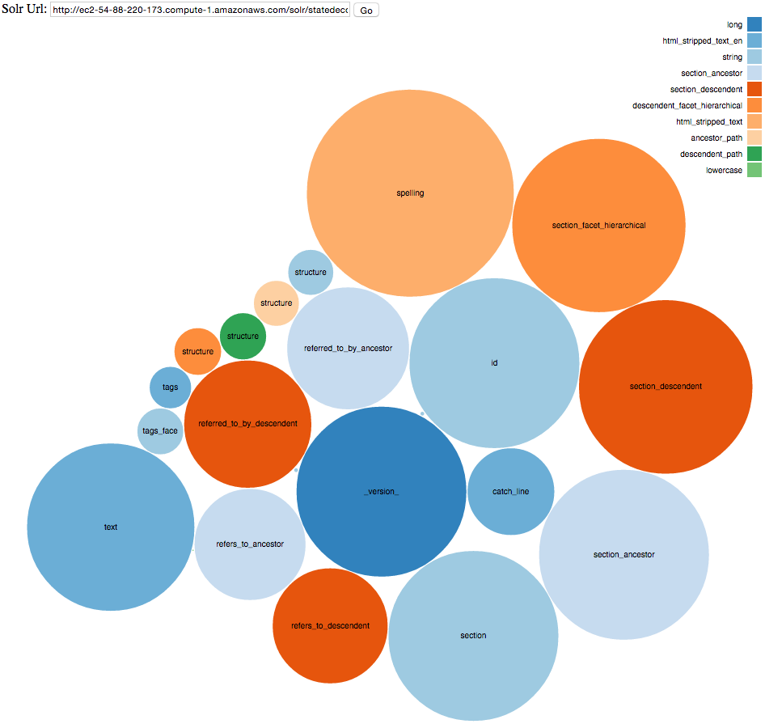

---
---
# Bearded Wookie: Experiments in Visualizing Lucene

These are some experiments with [D3](http://d3js.org) in visualizing details of a Lucene index via the Solr APIs.  Primarily a learning exercise for me to learn JavaScript, especially Ajax calls, and dip my toes into D3.   Each of the experiments is based heavily on work that other folks have done!

## Bubble Map
The bubble map shows you how many terms there are per field.  The colors let you get a sense of which field types contain the most terms.  The name of each field is in the center of the bubble.   The layout is random, there isn't any meaning to where the bubbles are placed.  The colours are also laid out to be in a logical range, but internally have no meaning.  Hence dark blue is `long` and light blue is `string`.


[Play with the demo here](http://opensourceconnections.com/bearded-wookie/bubble/bubble2.html)


## Treemap

The treemap experiment was more ambitious and came out in response to a "data management" person asking me:
> Can I have the entity relatinoship diagram for Solr?

After scratching my head for while on what I could give them that wasn't just a single "table", and looking like a snarky jerk, I figured how about better understanding all the various field types that make up a Lucene index.   Even better would be to organize the types according to their object hierarchy.  For bonus points, I tried to also give a sense not just of term count, but of how much memory each field would take up.


In the tree map I show each field, with a colour coded organization of the hierarchy of field types, as Solr understands them.  For example, a `TrieLongField` is a subclass of a `TrieField`.   The size of the box shows you how many terms make up the field in relationship to overall term count size.

The All Fields option shows you all the fields that you have defined in your `schema.xml`, and lets you see what fields you define but don't actually use.

The Memory option attempts to use the rules that are defined in this Memory calculator spreadsheet:
[https://svn.apache.org/repos/asf/lucene/dev/trunk/dev-tools/size-estimator-lucene-solr.xls](https://svn.apache.org/repos/asf/lucene/dev/trunk/dev-tools/size-estimator-lucene-solr.xls)   It's not perfect though!

[Play with the treemap demo here](http://opensourceconnections.com/bearded-wookie/treemap/).

A huge vote of appreciation to [Julia Bauder](https://github.com/julia-bauder) for her project [Pivot to Flare](https://github.com/GrinnellCollegeLibraries/Pivot_to_Flare) that got me much of the way on the tree map. 

Also, check out what Erik Hatcher [has done with tree maps and Solr](https://twitter.com/ErikHatcher/status/539818364018118656).


## How to run locally

Check the project out from GitHub at [https://github.com/o19s/bearded-wookie](https://github.com/o19s/bearded-wookie)

Start up a locally running server via:

```bash
ruby -run -e httpd . -p 9090
```

And then browse to [http://localhost:9090/bubble/bubble2.html](http://localhost:9090/bubble/bubble2.html) and [http://localhost:9090/treemap/](http://localhost:9090/treemap/)

Shoot feedback to me at epugh@opensourceconnections.com or [@dep4b](http://twitter.com/dep4b).

